# KaggleForge

## 总目标

KaggleForge 目标是构建一个面向 Kaggle / 机器学习竞赛的多阶段 agent 系统。

用户输入 Kaggle competition URL 后，系统自动完成：

```text
Kaggle URL
-> 读取竞赛信息与数据文件
-> 生成 task.md
-> calibration
-> strategy / decompose / execute / verify / evaluate
-> 保存 artifacts
-> 生成最终 report
```

KaggleForge 自己负责 workflow 编排、文件状态管理、前端展示和阶段推进；具体 agent 节点通过一次 Codex CLI 调用完成，并把结果写回当前 session 目录。

## 核心结构

- `main.py`: CLI 入口。
- `server.py`: FastAPI 后端，提供 API、SSE 和前端静态页面服务。
- `orchestrator.py`: pipeline 调度器。
- `stage.py`: stage 生命周期与事件发送。
- `stages/intake.py`: Kaggle 读取、`task.md`、`calibration.md`。
- `stages/research.py`: strategy、decompose、execute、verify、evaluate。
- `db.py`: 文件型 session 存储，结果写入 `results/<date>-<competition>/`。
- `agent_runtime.py`: agent 调用入口。
- `codex_runtime.py`: Codex CLI 调用封装。
- `frontend/`: 原生 HTML / CSS / JS 前端。

## Agent 运行流程框架

KaggleForge 的核心原则是：每个 agent 节点对应一次独立的 Codex CLI 执行；阶段之间不靠对话记忆传递信息，只靠 session 目录中的文件交接。

```mermaid
flowchart TD
    START["Kaggle competition URL"] -->|"save source"| SOURCE["source.md"]

    subgraph S1["Stage 1: Intake"]
        direction TB
        FETCH["Kaggle Fetch<br/>system step"]
        CAL["Calibrate Agent"]
        INTAKE_OUT["Intake Output Bundle<br/>task.md<br/>competition.json<br/>calibration.md<br/>data/&lt;competition&gt;/"]

        FETCH -->|"competition metadata + local data files"| CAL
        CAL -->|"atomic execution boundary"| INTAKE_OUT
    end

    subgraph S2["Stage 2: Research"]
        direction TB
        STRATEGY["Strategy Agent"]
        DECOMPOSE["Decompose Agent"]
        SCHED["DAG Scheduler<br/>system step"]
        EXECUTE["Execute Agent(s)<br/>parallel by ready task batch"]
        VERIFY["Verify Agent<br/>one verification per task"]
        DECISION{"Verification result"}
        REDECOMPOSE["Redecompose Agent<br/>only when task is too large or wrong"]
        EVALUATE["Evaluate Agent"]
        RESEARCH_OUT["Research Output Bundle<br/>strategy.md<br/>plan_list.json / plan_tree.json<br/>tasks/*.md<br/>verifications/*.json<br/>artifacts/**/*<br/>evaluation.json<br/>results_summary.*"]

        STRATEGY -->|"strategy.md"| DECOMPOSE
        DECOMPOSE -->|"plan_list.json + plan_tree.json"| SCHED
        SCHED -->|"ready task batch + workspace copy"| EXECUTE
        EXECUTE -->|"tasks/&lt;id&gt;.md + artifacts/&lt;id&gt;/*"| VERIFY
        VERIFY -->|"verifications/&lt;id&gt;.json"| DECISION
        DECISION -->|"pass: task summary + artifact manifest"| EVALUATE
        DECISION -->|"fail: retry review + previous output"| EXECUTE
        DECISION -->|"fail: redecompose request + failed output"| REDECOMPOSE
        REDECOMPOSE -->|"updated plan_list.json + plan_tree.json"| SCHED
        EVALUATE -->|"evaluation.json + results_summary.*"| RESEARCH_OUT
    end

    subgraph S3["Stage 3: Report"]
        direction TB
        COLLECT["Collect Context<br/>system step"]
        WRITER["Writer Agent"]
        REVIEWER["Reviewer Agent"]
        POLISH["Polish Agent"]
        REPORT_OUT["Report Output Bundle<br/>report_context.md / .json<br/>paper.md<br/>report_review.json<br/>paper_polished.md"]

        COLLECT -->|"report_context.md + report_context.json"| WRITER
        WRITER -->|"paper.md"| REVIEWER
        REVIEWER -->|"report_review.json + review feedback"| POLISH
        POLISH -->|"paper_polished.md"| REPORT_OUT
    end

    SOURCE -->|"Kaggle URL"| FETCH
    INTAKE_OUT -->|"task + metadata + calibration + data path"| STRATEGY
    INTAKE_OUT -->|"same context for decomposition and execution"| DECOMPOSE
    INTAKE_OUT -->|"task.md + competition.json + data path copied into task workspace"| EXECUTE
    RESEARCH_OUT -->|"all research artifacts and verification records"| COLLECT
    INTAKE_OUT -->|"task context and calibration"| COLLECT
    REPORT_OUT --> END["Pipeline Completed"]

    classDef system fill:#312e81,stroke:#a5b4fc,color:#f8fafc;
    classDef agent fill:#064e3b,stroke:#6ee7b7,color:#f8fafc;
    classDef bundle fill:#111827,stroke:#94a3b8,color:#f8fafc;
    classDef decision fill:#78350f,stroke:#fbbf24,color:#f8fafc;

    class FETCH,SCHED,COLLECT system;
    class CAL,STRATEGY,DECOMPOSE,EXECUTE,VERIFY,REDECOMPOSE,EVALUATE,WRITER,REVIEWER,POLISH agent;
    class SOURCE,INTAKE_OUT,RESEARCH_OUT,REPORT_OUT,START,END bundle;
    class DECISION decision;
```



### Agent 输入输出表

| 阶段 | 节点 | 类型 | 主要输入 | 主要输出 | 作用 |
| --- | --- | --- | --- | --- | --- |
| Intake | Kaggle fetch | 系统步骤 | `source.md` | `competition.json`, `task.md`, `data/<competition>/` | 从 Kaggle URL 获取竞赛元数据、文件列表和本地数据。 |
| Intake | Calibrate | Agent | `task.md`, `competition.json`, runtime 配置 | `calibration.md` | 定义一次 agent 执行的原子任务边界。 |
| Research | Strategy | Agent | `task.md`, `competition.json`, `calibration.md` | `strategy.md` | 制定整体建模与执行策略。 |
| Research | Decompose | Agent | `task.md`, `competition.json`, `calibration.md`, `strategy.md` | `plan_tree.json`, `plan_list.json` | 把策略拆成带依赖关系的原子任务 DAG。 |
| Research | Execute | Agent，可并行 | 单个 plan task、依赖 summary、session 文件副本、独立 workspace | `tasks/<id>.md`, `artifacts/<id>/*` | 在独立 workspace 中完成一个原子任务并产生产物。 |
| Research | Verify | Agent | 当前 task、execute 输出 | `verifications/<id>.json` | 判断任务是否通过，给出 review，并决定是否需要 retry 或 redecompose。 |
| Research | Redecompose | Agent，复用 Decompose | failed task、execute output、verify review、原 plan | 更新 `plan_tree.json`, `plan_list.json` | 把过大的失败任务拆成更小子任务。 |
| Research | Evaluate | Agent | strategy、plan、completed summaries、artifacts | `evaluation.json`, `results_summary.*` | 汇总 research 阶段是否足够进入报告阶段。 |
| Report | Collect | 系统步骤 | research 全部关键产物 | `report_context.json`, `report_context.md` | 把最终报告所需事实打包成稳定上下文。 |
| Report | Writer | Agent | `report_context.md` | `paper.md` | 生成技术报告初稿。 |
| Report | Reviewer | Agent | `report_context.md`, `paper.md` | `report_review.md`, `report_review.json` | 审查报告是否忠实于真实产物。 |
| Report | Polish | Agent | `report_context.md`, `paper.md`, `report_review.json` | `paper_polished.md` | 根据审稿意见润色并输出最终报告。 |

### 前端展示建议

右侧不一定要展示所有文件。更清晰的划分可以是：

- Overview：只展示当前 session、stage 状态、最终关键产物。
- Plan：展示 `plan_list.json` 的 DAG 任务定义。
- Runs：展示 execute / verify 的运行记录、attempt、retry、redecompose 和任务产物。
- Artifacts：只展示 `artifacts/` 下真正可复用的结果文件。
- Report：展示 `paper.md`、`report_review.json`、`paper_polished.md`。
- Raw Files：作为调试入口，折叠展示完整 session 文件树。

## 2026-06-14 进展

今天主要完成了前端接入和前后端通信闭环。

新增前端：

- `frontend/index.html`: 页面结构。
- `frontend/styles.css`: 页面样式。
- `frontend/app.js`: 前端交互逻辑。

前端目前可以输入 Kaggle URL、启动 pipeline、查看运行日志、查看 session 文件、plan、tasks 和 artifacts。

后端新增 `server.py`，使用 FastAPI + Uvicorn 提供服务：

```text
frontend/app.js
-> POST /api/pipeline/start
-> server.py
-> Orchestrator.start()
-> Stage.run()
-> stage.emit()
-> Orchestrator.broadcast()
-> GET /api/events
-> frontend/app.js 更新页面状态
```

前端不直接调用 Codex，也不直接读写文件。前端只和 FastAPI 通信；FastAPI 调 orchestrator；orchestrator 调 stage；stage 再通过 agent runtime 调 Codex CLI。

今天也确认了 Codex 运行方式：

- Docker provider 会受容器网络影响，当前不适合作为默认调试方式。
- Local provider 更适合当前开发，使用宿主机 Codex CLI，并保留 `workspace-write` sandbox。
- 如果 Codex CLI 网络超时，需要在当前 PowerShell 设置代理后再运行。

当前推荐配置：

```env
KAGGLEFORGE_RUNTIME=codex
KAGGLEFORGE_CODEX_SANDBOX_PROVIDER=local
KAGGLEFORGE_CODEX_SANDBOX=workspace-write
```

另外修复了 Windows + Uvicorn 下调用 Codex 子进程的问题：将 `asyncio.create_subprocess_exec` 改为 `asyncio.to_thread(subprocess.run, ...)`，避免前端运行时报 `NotImplementedError`。

## 2026-06-15 进展

今天主要补齐了最终 `report stage`：

- 将主流程扩展为 `intake -> research -> report`。
- `report stage` 会汇总 research 产物，生成 `report_context.json` 和 `report_context.md` 作为最终报告的事实包。
- 新增 Writer / Reviewer / Polish 三步：先写 `paper.md`，再审查生成 `report_review.json`，最后润色输出 `paper_polished.md`。
- 最终报告会追加 KaggleForge 执行记录，包含 session、任务数、验证通过数、artifact 数和关键文件清单。
- 前端 Docs 列表新增 report 相关文件，方便在网页中查看最终报告和审查结果。

Windows对Codex cli的适配太差了，windows sandbox有问题，codex启动本地powershell进程也有问题，只能在wsl的linux环境中启动，太麻烦了，目前准备换Mac电脑。

## 2026-06-16 进展

今天补齐了 research stage 中 execute agent 的 DAG 并行能力：

- 根据 `plan_list.json` 中的 `dependencies` 做拓扑分批。
- 同一批无依赖冲突的 execute task 会并行运行。
- 每个 task 使用独立 `workspaces/<task_id>/` 执行，避免并行写文件互相污染。
- task 的 `workspace/artifacts/` 会同步回 session 的 `artifacts/<task_id>/`，供 verify、report 和前端查看。后期考虑单次agent执行的衍生文件是不是要销毁，但销毁会失去可追溯性。
- 新增 `KAGGLEFORGE_API_CONCURRENCY` 控制最大并行数，默认 `3`。

## 2026-06-17 进展

今天主要完善了前端运行状态展示和配置可靠性：

- 前端新增 Stage / Agent 状态面板，展示 `intake / research / report` 和各 agent 节点的运行状态。
- SSE 事件现在会驱动前端实时更新 running / completed / failed，以及 execute 的 task、batch、attempt 信息。
- Session Docs 增加文件生成状态灯，已生成文件会高亮显示。
- 修复新一轮 pipeline 复用上一轮 completed 状态的问题。
- 修复 `.env` 带 BOM 导致 `KAGGLEFORGE_RUNTIME=codex` 读取失败、实际回退到 mock 的问题。
- 后端 runtime 状态现在会明确显示当前是 `codex` 还是 `mock`。
